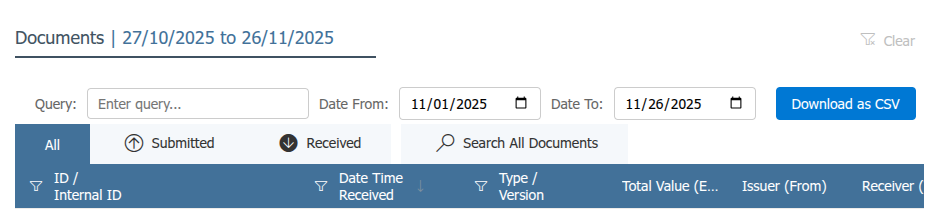

# Eta Retrieve Invoices Browser Extension

A browser extension that helps you download multiple documents in bulk and export detailed information in CSV format.

## Screenshot

## Features

- **Bulk Document Download**: Download several documents at once with a single click
- **Detailed CSV Export**: Export comprehensive document details to CSV files for easy analysis
- **Separate File Organization**: Documents and details are organized into separate files for better data management

## Installation

1. Clone this repository
2. Open your browser's extension management page
   - Chrome: `chrome://extensions/`
3. Enable "Developer mode"
4. Click "Load unpacked" and select the extension directory

## Usage

1. Navigate to the `https://invoicing.eta.gov.eg/documents` page.
2. Click the extension icon in your browser toolbar - buttons will be added with (query, date) options.
3. Select your needed date (and query {optional}) you want to download.
4. Click "Download as CSV" to save files to your computer.

## Requirements

- Modern web browser
- JavaScript enabled
